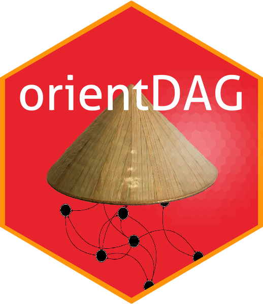

# simMixedDAG

The orientDAG package is used to orient DAG edges. It also includes utility functions to convert DAGs between different representations as well as measure DAG dissimilarity measures.

For a "vignette" of sorts see my [blog post](https://iyarlin.github.io/2019/07/23/automatic_DAG_learning_part_2/).

I'm a rather poor progarammer and there's probably plenty of bugs abound.  
If you happen to run into trouble please open an issue or consider improving the code.

Kudos to Guangchuang YU for authoring the cool [hexSticker](https://github.com/GuangchuangYu/hexSticker) package, which makes creating hexagon sticker for your package (like the one on the right) a breeze.  